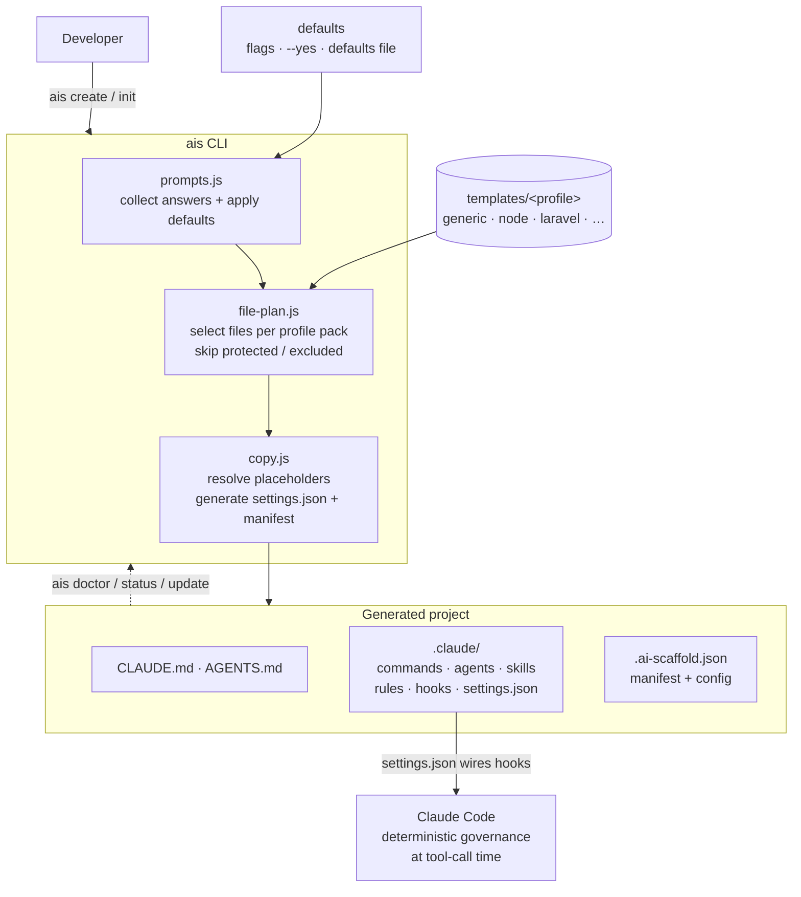

# Release Plan — v0.9.0 (Correctness) + v0.10.0 (Curation & DX)

Status: v0.9.0 in progress on branch `fix/v0.9.0-correctness`. **Done + verified:**
live hooks (packaging fix), posix manifest paths, governance skeleton on `create`,
`doctor` as a real gate, template doc reword (dangling refs), plus smoke-gate +
pack-regression coverage. **Deferred to a v0.9.0 follow-up:** `git init` + shipped
`.gitattributes` on `create`, and interactive profile verification-command defaults.
Grounded in defects verified against a real generated project
(`/Users/lajinmohan/website/test-app`, node profile, CLI 0.8.2) and a gap review of
commands, agents, skills, rules, hooks, and templates. Verify against generated
output, not the working tree — the working tree hides packaging defects.

---

## 1. Why two releases

- **v0.9.0 "Generated projects work"** — correctness. A freshly generated project
  must have live hooks, no dangling references, be a git repo, and pass `doctor`.
  Ship this before any dev team touches the CLI.
- **v0.10.0 "Curation & profiles"** — DX and extensibility. Profile packs (ship a
  curated subset while keeping everything in the repo), new stack profiles, a
  reusable defaults file, discoverability, and the README/tutorial rewrite.

Rule: v0.9.0 makes it correct; v0.10.0 makes it adoptable. Do not let v0.10.0
features block the v0.9.0 correctness fixes.

---

## 2. Gap analysis — what is missing that adds value

| Gap | Evidence | Value | Release |
|---|---|---|---|
| Hooks inert in generated projects | `templates/*/.gitignore` bare `settings.json` rule (node:84, generic:85); `npm pack` ships zero `settings.json`; test-app has hook scripts but no `.claude/settings.json` | Restores the core value prop | v0.9.0 |
| Dangling doc references | test-app `CLAUDE.md` cites 27 paths that do not exist (tasks/lessons.md×8, tasks/todo×6, apps/api/src×5, CHANGELOG.md×4, scripts/install-hooks.sh, task-size-policy.md; ponytail-ladder→HOW-TO-USE×2) | Stops self-contradiction (H1/H3) | v0.9.0 |
| `doctor` blind + never fails | `doctor.js` exits 0 on test-app; no settings.json/hooks/verification/dangling checks; no non-zero exit | Makes doctor a real gate | v0.9.0 |
| No git init on `create` | `create.js` steps 1–6, no git; `.gitattributes` excluded | Branching/commit governance works | v0.9.0 |
| `bootstrapped:true` + verification `none` | test-app (node/react) commands all `none`; profile defaults only apply on `--yes`, not interactive | Verification mandate is real | v0.9.0 |
| Manifest paths not posix | `buildManagedFileRecords` stores `path.join`/`path.relative` output → backslashes on Windows; breaks `doctor` drift check cross-platform | Cross-platform correctness | v0.9.0 |
| No profile→asset filtering | `file-plan.js` MANAGED_PATHS ships `.claude/**` wholesale | "Keep in repo, ship a subset per profile"; foundation for weight tiers | v0.10.0 |
| Profile↔stack mismatch | 8 stack overlays in `.claude/rules/stacks/`, only 3 CLI profiles | Python/Go/.NET/Java/PHP users can scaffold | v0.10.0 |
| No reusable defaults file | flags + `--yes` exist, but no user/org preset; interactive re-asks everything | Fast, repeatable setup | v0.10.0 |
| No discoverability command | CLI has 5 subcommands; no `ais list` for the 35 slash-commands/agents/skills | Right command for the right job | v0.10.0 |
| No architecture diagram / Core-6 on-ramp | README has no diagram; no "start with N commands" | Onboarding | v0.10.0 (docs) |
| README/tutorial reality pass | README references full workflow the minimal install can't fully run | Trust | v0.9.0 (docs) |

Not defects (verified false): encoding/mojibake (zero), missing skeleton in the
scaffold repo (all present), settings.json "ghost" (it is real — inert hooks).

---

## 3. Prioritized backlog

Priority: P0 = ship-blocker · P1 = high · P2 = medium. Effort: S <1h · M few h · L day+.

### v0.9.0 — Correctness

| # | Item | Pri | Effort | Where |
|---|---|---|---|---|
| 1 | Ship live hooks: generate `.claude/settings.json` in `copy.js` (static hooks block, same pattern as `settings-overrides.json`); remove bare `settings.json` from template `.gitignore`s; add a pack test asserting a `settings.json` ships | P0 | M | `src/cli/core/copy.js`, `src/cli/core/file-plan.js`, `templates/*/.gitignore`, `src/__tests__` |
| 2 | Kill dangling refs: ship a minimal governance skeleton (`tasks/lessons.md`, `tasks/{todo,done}/.gitkeep`, `CHANGELOG.md`, `docs/process/task-size-policy.md`) and reword `apps/api/src` + `HOW-TO-USE` references in shipped `CLAUDE.md`/rules to "optional pack" | P0 | M | `file-plan.js` EXCLUDED_DEFAULT_PATTERNS, `templates/*/CLAUDE.md`, `templates/*/.claude/rules/ponytail-ladder.md` |
| 3 | Make `doctor` a gate: non-zero exit on failures; add checks for settings.json+hooks wired, `bootstrapped && verification=none`, dangling `CLAUDE.md` refs | P0 | M | `src/cli/commands/doctor.js` |
| 4 | `create` runs `git init` + initial commit (opt-out `--no-git`); ship `.gitattributes` (CHANGELOG `merge=union`) | P1 | M | `src/cli/commands/create.js`, `file-plan.js` |
| 5 | Apply per-profile command defaults in interactive mode too (fixes verification=none) | P1 | S | `src/cli/core/prompts.js` |
| 6 | Posix-normalize manifest paths | P1 | S | `src/cli/core/copy.js` `buildManagedFileRecords` |
| 7 | Investigate root `README.md` not generated in test-app; sync scaffold self-marker `.ai-scaffold.json`→0.8.2 + assert-equal test | P2 | S | `file-plan.js`/`copy.js`, `.ai-scaffold.json` |
| 8 | README reality pass + add Core-6 on-ramp + architecture diagram | P1 | M | `README.md`, `templates/*/README.template.md` |

**v0.9.0 exit gate (make it a CLI integration test):** on a clean
`ais create demo --profile node --yes`, then `cd demo`: `.claude/settings.json`
present with a `hooks` block; `ais doctor` exits 0 with new checks green; zero
dangling refs (every path cited in `CLAUDE.md` resolves); it is a git repo;
manifest paths are posix.

### v0.10.0 — Curation & DX

| # | Item | Pri | Effort | Where |
|---|---|---|---|---|
| 9 | **Profile packs** — ship a curated asset subset per profile while keeping everything in the repo (see §4) | P1 | L | new `src/cli/core/packs.js`, `file-plan.js` |
| 10 | New stack profiles wired to existing overlays: python, go, dotnet, java, php | P1 | M | `paths.js` SUPPORTED_PROFILES, `templates/<profile>/`, `applyProfileDefaults` |
| 11 | Reusable **defaults file** (`~/.config/ai-scaffold/defaults.json` + cwd `.ais-defaults.json` + `--defaults <file>`) feeding both interactive `initial:` and `resolveWithDefaults` | P1 | M | `src/cli/core/prompts.js`, new loader |
| 12 | `ais list [commands|agents|skills|rules]` discoverability command | P2 | S | new `src/cli/commands/list.js` |
| 13 | Weight tiers layered on packs: `--tier lite|standard|regulated` | P2 | M | `packs.js` |
| 14 | Tutorial/HOW-TO-USE reality pass + link to Core-6 | P2 | S | `HOW-TO-USE.md`, `docs/ai-os/` |

---

## 4. Profile packs — design (v0.10.0, the "keep in repo, ship a subset" ask)

Goal: the repo keeps every command/agent/skill/rule; the CLI copies only what a
profile needs. Nothing is deleted; selection is additive per profile.

Design:
- Add `src/cli/core/packs.js` exporting a map:
  ```
  export const PROFILE_PACKS = {
    core:    { commands: ['what-next','start-task','review','debug-fix','commit-changes','lessons'], agents:[...], skills:[...], rules:['ai-coding-rules','coding-standards','security-rules','testing-rules','review-rules'] },
    node:    { extends:'core', commands:[...], rules:['stacks/backend-node'] },
    laravel: { extends:'core', rules:['stacks/backend-php'] },
    // future: python/go/dotnet extend core + their stack overlay
  };
  ```
- `file-plan.js`: when a source path is under `.claude/{commands,agents,skills,rules}/`,
  include it only if the resolved pack lists it; everything else in `.claude/**`
  (hooks, settings, lib, memory scaffolding) always ships.
- Default behaviour without packs configured = ship-all (backwards compatible).
- Weight tiers (v0.10.0 P2) select which packs compose: `lite` = core only;
  `standard` = core + stack; `regulated` = + compliance rules/agents.

This is the extension point for "add more profiles later": a new profile is a new
entry in `PROFILE_PACKS` + a `templates/<profile>/` dir, no engine changes.

---

## 5. Default values — where to set them

Precise locations (answering "where to update these default values"):

1. **Non-interactive / `--yes` global defaults:** `src/cli/core/prompts.js` →
   `resolveWithDefaults()` → `defaults` object (~lines 268–283).
2. **Per-profile defaults (stack + test/lint/typecheck/build):**
   `src/cli/core/prompts.js` → `applyProfileDefaults()` → `defaultsByProfile`
   (~lines 299–315). Add python/go/etc. here when adding profiles.
3. **Interactive prompt defaults:** `src/cli/core/prompts.js` → each prompt's
   `initial:` field (~lines 111–230).
4. **Placeholder token values** (the `N/A`/`GitHub Actions` fillers written into
   `CLAUDE.md`): `src/cli/core/copy.js` → `resolvePlaceholders()` `tokenMap`
   (~lines 324–358).
5. **(New, v0.10.0) user/org preset file:** `~/.config/ai-scaffold/defaults.json`
   and cwd `.ais-defaults.json`, plus `--defaults <file>`. Precedence:
   explicit flags > `--defaults` file > cwd `.ais-defaults.json` > user file >
   built-in defaults above.

Fast-path today (no new code): both `create` and `init` already accept every
field as a flag plus `--yes`, e.g.
`ais create billing-api --profile node --yes --frontend-stack react --multi-tenant`.
The defaults file (item 11) removes the need to re-type flags per project.

---

## 6. Architecture diagram (drop into README)



---

## 7. README/tutorial rewrite spec (v0.9.0 docs + v0.10.0 polish)

README must, in order:
1. **Problem it solves + how** — AI coding without guardrails ships hallucinated,
   unverified, inconsistent code; this repo installs a governance layer (rules +
   hooks + review agents) that makes verification and consistency the default.
2. **Who it is for / not** — for teams using Claude Code/Codex on real products;
   not for throwaway prototypes or non-AI workflows.
3. **When to use / not** — use when multiple devs use AI on production code; skip
   for one-off scripts or when you want zero process.
4. **Architecture diagram** (§6).
5. **Right command for the job** — example-per-scenario table (new project, add to
   existing repo, start a task, review, debug, QA, release-view).
6. **Core 6 on-ramp** — `/what-next`, `/start-task`, `/review`, `/debug-fix`,
   `/commit-changes`, `/lessons`; everything else opt-in.
7. **Reality pass** — remove/curate references to files the default install does
   not ship (align with v0.9.0 item 2).

HOW-TO-USE.md: add the Core-6 on-ramp near the top; reality-pass the stage guide so
it matches the minimal install.
